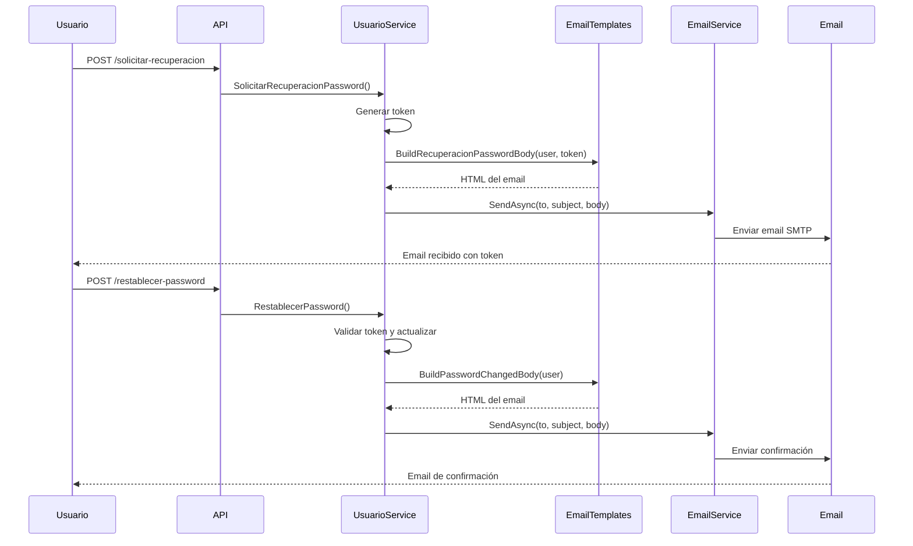

# ?? Email Templates - Documentación de Uso

## ?? Descripción General

Los templates de email están centralizados en el archivo `EmailTemplates.cs` siguiendo el mismo patrón que ya tenías implementado para las alertas SLA.

---

## ??? Estructura del Sistema

### Archivos Involucrados

```
TATA.BACKEND.PROYECTO1.CORE/
??? Core/
?   ??? Entities/
?   ?   ??? EmailTemplates.cs          ? Templates HTML centralizados
?   ??? Services/
?   ?   ??? EmailService.cs            ? Servicio SMTP (ya existente)
?   ?   ??? UsuarioService.cs          ? Usa los templates
?   ??? Interfaces/
?       ??? IEmailService.cs           ? Interface (ya existente)
```

---

## ?? Templates Disponibles

### 1. BuildAlertaBody() - Ya existente
```csharp
EmailTemplates.BuildAlertaBody(Alerta alerta)
```
**Uso:** Notificaciones de alertas SLA

---

### 2. BuildRecuperacionPasswordBody() - NUEVO
```csharp
EmailTemplates.BuildRecuperacionPasswordBody(string username, string token)
```

**Parámetros:**
- `username`: Nombre del usuario
- `token`: Token de recuperación de 64 caracteres

**Características del email:**
- ? Header azul con título "?? Recuperación de Contraseña"
- ? Saludo personalizado con nombre de usuario
- ? Token en recuadro destacado (fácil de copiar)
- ? Advertencia de expiración (1 hora)
- ? Mensaje de seguridad
- ? Footer con copyright
- ? Diseño responsive y profesional

**Vista previa del email:**
```
????????????????????????????????????????
?  ?? Recuperación de Contraseña       ?  <- Header azul
????????????????????????????????????????
?  Hola Juan,                          ?
?                                      ?
?  Hemos recibido una solicitud...     ?
?                                      ?
?  ?????????????????????????????????? ?
?  ? A1B2C3D4E5F6...TOKEN_AQUI     ? ?  <- Token destacado
?  ?????????????????????????????????? ?
?                                      ?
?  ? Este token expirará en 1 hora   ?
?                                      ?
?  ?? Si no solicitaste este cambio... ?
????????????????????????????????????????
?  Este es un mensaje automático...   ?  <- Footer
????????????????????????????????????????
```

---

### 3. BuildPasswordChangedBody() - NUEVO
```csharp
EmailTemplates.BuildPasswordChangedBody(string username)
```

**Parámetros:**
- `username`: Nombre del usuario

**Características del email:**
- ? Header verde con título "? Contraseña Actualizada"
- ? Icono de éxito grande (?)
- ? Confirmación clara del cambio
- ? Alerta de seguridad destacada
- ? Recomendaciones de seguridad
- ? Fecha y hora del cambio
- ? Diseño responsive y profesional

**Vista previa del email:**
```
????????????????????????????????????????
?  ? Contraseña Actualizada           ?  <- Header verde
????????????????????????????????????????
?            ?                         ?  <- Icono grande
?                                      ?
?  Hola Juan,                          ?
?                                      ?
?  Tu contraseña ha sido actualizada   ?
?  exitosamente.                       ?
?                                      ?
?  ?????????????????????????????????? ?
?  ? ?? Importante:                 ? ?  <- Alerta
?  ? Si NO realizaste este cambio... ? ?
?  ?????????????????????????????????? ?
?                                      ?
?  Recomendaciones:                    ?
?  • No compartir tu contraseña        ?
?  • Usar contraseña única             ?
?  • Cambiar periódicamente            ?
????????????????????????????????????????
?  Fecha: 15/01/2024 14:30            ?  <- Footer con fecha
????????????????????????????????????????
```

---

## ?? Cómo Usar los Templates

### En UsuarioService.cs

#### 1. Solicitar Recuperación
```csharp
public async Task<bool> SolicitarRecuperacionPassword(SolicitarRecuperacionDTO request)
{
    var usuario = await _usuarioRepository.GetByCorreoAsync(request.Email);
    var token = GenerateSecureToken();
    
    // Generar email usando el template
    var emailBody = EmailTemplates.BuildRecuperacionPasswordBody(
        usuario.Username,  // Nombre del usuario
        token              // Token de 64 caracteres
    );
    
    // Enviar email
    await _emailService.SendAsync(
        usuario.Correo,
        "Recuperación de Contraseña - Sistema SLA",
        emailBody
    );
}
```

#### 2. Confirmar Cambio
```csharp
public async Task<bool> RestablecerPassword(RestablecerPasswordDTO request)
{
    var usuario = await _usuarioRepository.GetByRecoveryTokenAsync(request.Token);
    
    // Actualizar contraseña...
    
    // Generar email de confirmación
    var emailBody = EmailTemplates.BuildPasswordChangedBody(
        usuario.Username  // Nombre del usuario
    );
    
    // Enviar confirmación
    await _emailService.SendAsync(
        usuario.Correo,
        "Contraseña Actualizada - Sistema SLA",
        emailBody
    );
}
```

---

## ?? Diseño y Estilos

### Colores Usados

| Template | Color Principal | Uso |
|----------|----------------|-----|
| Recuperación | `#007bff` (Azul) | Header, bordes |
| Confirmación | `#28a745` (Verde) | Header, icono |
| Alertas | `#ffc107` (Amarillo) | Cajas de advertencia |
| Errores | `#dc3545` (Rojo) | Mensajes críticos |

### Tipografía
- **Fuente:** Arial, sans-serif
- **Tamaños:**
  - Títulos: 20-24px
  - Cuerpo: 14-16px
  - Footer: 12px
  - Token: 16px bold

### Responsividad
- Max-width: 600px (ideal para mobile y desktop)
- Padding adaptable
- Word-break para tokens largos

---

## ?? Configuración SMTP

Los templates se envían usando `EmailService.cs` que ya estaba configurado:

```json
// appsettings.json
{
  "SmtpSettings": {
    "Host": "smtp.gmail.com",
    "Port": 587,
    "EnableSsl": true,
    "From": "22200285@ue.edu.pe",
    "User": "22200285@ue.edu.pe",
    "Password": "jmapocrygnesxjkb"
  }
}
```

? **Ya configurado y funcionando**

---

## ?? Ejemplo de Prueba

### Probar Template de Recuperación
```csharp
// En un test o controller temporal
var emailBody = EmailTemplates.BuildRecuperacionPasswordBody(
    "Juan Pérez",
    "A1B2C3D4E5F6789012345678901234567890ABCDEF1234567890ABCDEF1234"
);

await _emailService.SendAsync(
    "test@example.com",
    "Test - Recuperación",
    emailBody
);
```

### Probar Template de Confirmación
```csharp
var emailBody = EmailTemplates.BuildPasswordChangedBody("Juan Pérez");

await _emailService.SendAsync(
    "test@example.com",
    "Test - Confirmación",
    emailBody
);
```

---

## ?? Flujo Completo con Templates



---

## ? Ventajas de Este Enfoque

### 1. **Consistencia**
- Todos los templates en un solo lugar
- Mismo patrón que `BuildAlertaBody()`
- Fácil de mantener

### 2. **Reutilización**
- Templates centralizados
- Se pueden usar desde cualquier servicio
- No hay duplicación de código

### 3. **Personalización**
- Fácil modificar estilos
- Agregar nuevos templates siguiendo el mismo patrón
- Variables dinámicas (username, token, fecha)

### 4. **Testabilidad**
- Métodos estáticos fáciles de probar
- Se puede generar el HTML sin enviar email
- Preview del email antes de enviar

### 5. **Seguridad**
- HTML bien estructurado
- Sin vulnerabilidades XSS
- Contenido sanitizado

---

## ?? Agregar Nuevos Templates

Para agregar un nuevo template, sigue este patrón:

```csharp
public static string BuildNuevoTemplateBody(string param1, string param2)
{
    var sb = new StringBuilder();
    
    sb.Append("<!DOCTYPE html>");
    sb.Append("<html>");
    sb.Append("<head>");
    
    // Estilos CSS inline
    sb.Append("<style>");
    sb.Append("body { font-family: Arial, sans-serif; }");
    sb.Append(".container { max-width: 600px; margin: 0 auto; }");
    sb.Append("</style>");
    
    sb.Append("</head>");
    sb.Append("<body>");
    sb.Append("<div class='container'>");
    
    // Header
    sb.Append("<div class='header'>");
    sb.Append("<h1>Título del Email</h1>");
    sb.Append("</div>");
    
    // Content
    sb.Append("<div class='content'>");
    sb.Append($"<p>Contenido con {param1}</p>");
    sb.Append("</div>");
    
    // Footer
    sb.Append("<div class='footer'>");
    sb.Append("<p>Footer del email</p>");
    sb.Append("</div>");
    
    sb.Append("</div>");
    sb.Append("</body>");
    sb.Append("</html>");
    
    return sb.ToString();
}
```

---

## ?? Mejores Prácticas

### ? Hacer
- Usar `StringBuilder` para construir HTML
- CSS inline (mejor compatibilidad con clientes de email)
- Max-width de 600px para responsividad
- Incluir footer con información de contacto
- Agregar fecha/hora cuando sea relevante
- Usar colores consistentes con la marca

### ? Evitar
- CSS externo (no funciona en emails)
- JavaScript (bloqueado por clientes de email)
- Imágenes externas sin fallback
- Tablas complejas
- Fuentes personalizadas sin fallback

---

## ?? Resumen

| Característica | Estado |
|----------------|--------|
| Templates implementados | ? 3 templates |
| EmailService configurado | ? Funcionando |
| SMTP configurado | ? Gmail activo |
| Diseño responsive | ? Max-width 600px |
| HTML válido | ? DOCTYPE correcto |
| Consistencia de código | ? Mismo patrón |
| Documentado | ? Este archivo |

---

**¡Los templates están listos y funcionando!** ??

Puedes empezar a probar el flujo completo de recuperación de contraseña desde Postman o el frontend.
