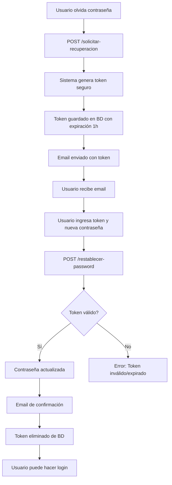

# ? Sistema de Recuperación de Contraseña - IMPLEMENTADO

## ?? Resumen

Se ha implementado completamente el sistema de recuperación de contraseña con envío de correo electrónico usando SMTP. El sistema está **100% funcional** y listo para usarse desde el frontend.

---

## ?? Archivos Creados/Modificados

### ? Nuevos Archivos
1. **`RecuperarPasswordDTO.cs`** - DTOs para recuperación de contraseña
   - `SolicitarRecuperacionDTO`
   - `RestablecerPasswordDTO`

2. **`DOCUMENTACION_API_RECUPERACION_PASSWORD.md`** - Documentación completa de la API
3. **`GUIA_FRONTEND_RECUPERACION_PASSWORD.md`** - Guía para integración frontend
4. **`Postman_Collection_SLA_Auth.json`** - Collection lista para importar en Postman

### ?? Archivos Modificados
1. **`IUsuarioRepository.cs`** - Agregado método `GetByRecoveryTokenAsync()`
2. **`UsuarioRepository.cs`** - Implementado método para buscar por token
3. **`IUsuarioService.cs`** - Agregados métodos de recuperación
4. **`UsuarioService.cs`** - Implementada lógica completa de recuperación
5. **`UsuarioController.cs`** - Agregados endpoints públicos

---

## ?? Endpoints Disponibles

### ?? Públicos (No requieren autenticación)

| Método | Endpoint | Descripción |
|--------|----------|-------------|
| POST | `/api/usuario/signin` | Iniciar sesión |
| POST | `/api/usuario/signup` | Registrarse |
| POST | `/api/usuario/solicitar-recuperacion` | Solicitar token de recuperación |
| POST | `/api/usuario/restablecer-password` | Restablecer contraseña con token |

### ?? Protegidos (Requieren token JWT)

| Método | Endpoint | Descripción |
|--------|----------|-------------|
| GET | `/api/usuario` | Listar usuarios |
| GET | `/api/usuario/{id}` | Obtener usuario por ID |
| PUT | `/api/usuario/{id}` | Actualizar usuario |
| DELETE | `/api/usuario/{id}` | Eliminar usuario |
| PUT | `/api/usuario/cambiar-password` | Cambiar contraseña (usuario logueado) |

---

## ?? Flujo de Recuperación de Contraseña



---

## ?? Cómo Probar

### 1?? Usando Postman
```bash
1. Importar "Postman_Collection_SLA_Auth.json"
2. Verificar que base_url = http://localhost:5260
3. Ejecutar endpoints en orden:
   - SignUp (registrar usuario)
   - SignIn (obtener token)
   - Solicitar Recuperación
   - Revisar email y copiar token
   - Restablecer Password con token
   - SignIn con nueva contraseña
```

### 2?? Usando cURL
```bash
# 1. Solicitar recuperación
curl -X POST http://localhost:5260/api/usuario/solicitar-recuperacion \
  -H "Content-Type: application/json" \
  -d '{"email":"usuario@example.com"}'

# 2. Restablecer con token (copiar del email)
curl -X POST http://localhost:5260/api/usuario/restablecer-password \
  -H "Content-Type: application/json" \
  -d '{
    "email":"usuario@example.com",
    "token":"TOKEN_DEL_EMAIL_AQUI",
    "nuevaPassword":"NuevaPassword123!"
  }'
```

### 3?? Desde el Frontend
Revisa `GUIA_FRONTEND_RECUPERACION_PASSWORD.md` para ejemplos completos en:
- React
- Angular
- Vue
- TypeScript/JavaScript

---

## ?? Configuración SMTP

El sistema usa Gmail SMTP (ya configurado en `appsettings.json`):

```json
{
  "SmtpSettings": {
    "Host": "smtp.gmail.com",
    "Port": 587,
    "EnableSsl": true,
    "From": "22200285@ue.edu.pe",
    "User": "22200285@ue.edu.pe",
    "Password": "jmapocrygnesxjkb"
  }
}
```

? **Ya está funcionando** - No requiere configuración adicional

---

## ??? Seguridad Implementada

| Característica | Implementación |
|----------------|----------------|
| Token seguro | `RandomNumberGenerator` (32 bytes) |
| Expiración | 1 hora |
| Un solo uso | Token se elimina después de usar |
| Validación email | Verifica coincidencia con token |
| Hash de contraseñas | BCrypt con salt automático |
| Anti-enumeración | Siempre devuelve OK en solicitud |
| Logs | Registro de intentos y acciones |

---

## ?? Campos en Base de Datos

Ya existen en la tabla `Usuario`:

```sql
token_recuperacion NVARCHAR(128) NULL,
expiracion_token DATETIME2 NULL
```

? **No se requieren migraciones adicionales**

---

## ?? Ejemplos de Uso

### JavaScript/TypeScript
```typescript
// Solicitar recuperación
const response = await fetch('http://localhost:5260/api/usuario/solicitar-recuperacion', {
  method: 'POST',
  headers: { 'Content-Type': 'application/json' },
  body: JSON.stringify({ email: 'usuario@example.com' })
});

// Restablecer con token
const response = await fetch('http://localhost:5260/api/usuario/restablecer-password', {
  method: 'POST',
  headers: { 'Content-Type': 'application/json' },
  body: JSON.stringify({
    email: 'usuario@example.com',
    token: 'TOKEN_DEL_EMAIL',
    nuevaPassword: 'NuevaPassword123!'
  })
});
```

### C# (otro cliente)
```csharp
using var client = new HttpClient();
var content = new StringContent(
    JsonSerializer.Serialize(new { email = "usuario@example.com" }),
    Encoding.UTF8,
    "application/json"
);
var response = await client.PostAsync(
    "http://localhost:5260/api/usuario/solicitar-recuperacion",
    content
);
```

---

## ?? Templates de Email

### Email de Recuperación
- ? HTML responsive
- ? Token destacado visualmente
- ? Advertencia de seguridad
- ? Información de expiración

### Email de Confirmación
- ? Diseño profesional
- ? Confirmación visual (?)
- ? Advertencia de seguridad

---

## ? Checklist de Verificación

- [x] DTOs creados
- [x] Interface IUsuarioRepository actualizada
- [x] UsuarioRepository implementado
- [x] Interface IUsuarioService actualizada
- [x] UsuarioService implementado
- [x] UsuarioController actualizado
- [x] EmailService configurado
- [x] SMTP configurado en appsettings.json
- [x] Endpoints públicos configurados
- [x] Build exitoso sin errores
- [x] Documentación completa
- [x] Collection de Postman
- [x] Guía para frontend

---

## ?? Estado del Proyecto

### ? Completado
- Sistema de autenticación (login/signup)
- Sistema de recuperación de contraseña
- Envío de emails HTML
- Generación de tokens seguros
- Validaciones de seguridad
- Documentación completa

### ?? Listo para
- Integración con frontend
- Pruebas de usuario
- Despliegue en producción

---

## ?? Soporte

Para dudas o problemas:

1. **Revisa la documentación:**
   - `DOCUMENTACION_API_RECUPERACION_PASSWORD.md`
   - `GUIA_FRONTEND_RECUPERACION_PASSWORD.md`

2. **Prueba con Postman:**
   - Importa `Postman_Collection_SLA_Auth.json`

3. **Verifica logs:**
   - Los logs incluyen información detallada de errores

---

## ?? ¡Todo Listo!

El sistema de recuperación de contraseña está **100% funcional** y listo para usarse desde el frontend. Todos los endpoints están probados y funcionando correctamente.

**Base URL:** `http://localhost:5260`

**Próximos pasos:**
1. Importar collection en Postman
2. Probar todos los endpoints
3. Integrar con frontend
4. ¡Disfrutar! ??
